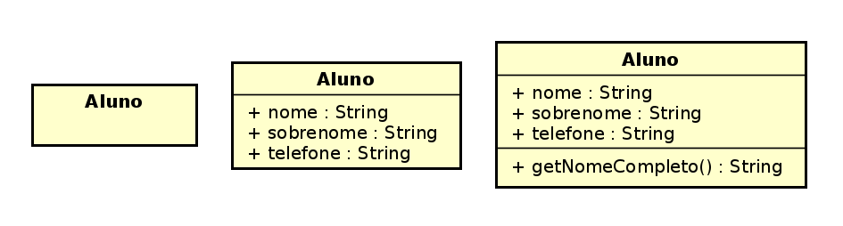
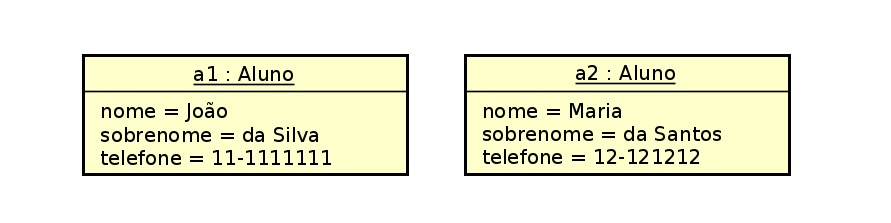

# Introdução a Orientação a Objetos

## Instruções

### Executar o projeto

No Linux
```bash
./gradlew run
```

No Windows
```bash
gradlew.bat run
```

### Rodar os testes

No Linux
```bash
./gradlew test --rerun-tasks
```

No Windows
```bash
gradlew.bat test --rerun-tasks
```

## Roteiros e Exemplos

### Classes, membros, objetos, diagrama de classes e objetos

Classe Aluno
```java
package exemplos;

public class Aluno {
   
}
```

Atributos da classe Aluno
```java
package exemplos;

public class Aluno {
    public String nome;
    public String sobrenome;
    public String telefone;
    
}
```

Método Main (ponto de início de execução programa)
```java
import exemplos.Aluno;

public class Main {
    public static void main(String[] args) {
        
    }
}
```


Criação de dois objetos Aluno e definição de valores para os atributos
```java
import exemplos.Aluno;

public class Main {
    public static void main(String[] args) {
        Aluno a1 = new Aluno();
        a1.nome = "João";
        a1.sobrenome = "da Silva";
        a1.telefone = "11-1111111";

        Aluno a2 = new Aluno();
        a2.nome = "Maria";
        a2.sobrenome = "do Santos";
        a2.telefone = "12-121212";
    }
}
```

Mostra na saída os valores dos atributos de cada aluno
```java
import exemplos.Aluno;

public class Main {
    public static void main(String[] args) {
        Aluno a1 = new Aluno();
        a1.nome = "João";
        a1.sobrenome = "da Silva";
        a1.telefone = "11-1111111";

        Aluno a2 = new Aluno();
        a2.nome = "Maria";
        a2.sobrenome = "do Santos";
        a2.telefone = "12-121212";

        System.out.println(a1.nome);
        System.out.println(a1.sobrenome);
        System.out.println(a1.nome + " " + a1.sobrenome);

        System.out.println(a2.nome);
        System.out.println(a2.sobrenome);
        System.out.println(a2.nome + " " + a2.sobrenome);
    }
}
```

Métodos para obter o nome completo de um aluno
```java
package exemplos;

public class Aluno {
    public String nome;
    public String sobrenome;
    public String telefone;

    public String getNomeCompleto() {
        return nome + " " + sobrenome;
    }
}
```

Chamando o método obter nome no Main
```java
import exemplos.Aluno;

public class Main {
    public static void main(String[] args) {
        Aluno a1 = new Aluno();
        a1.nome = "João";
        a1.sobrenome = "da Silva";
        a1.telefone = "11-1111111";

        Aluno a2 = new Aluno();
        a2.nome = "Maria";
        a2.sobrenome = "do Santos";
        a2.telefone = "12-121212";

        System.out.println(a1.nome);
        System.out.println(a1.sobrenome);
        //System.out.println(a1.nome + " " + a1.sobrenome);
        System.out.println(a1.getNomeCompleto());
        
        System.out.println(a2.nome);
        System.out.println(a2.sobrenome);
        //System.out.println(a2.nome + " " + a2.sobrenome);
        System.out.println(a2.getNomeCompleto());
    }
}
```

Diagrama de Classe de Aluno


```java
public class Aluno {
    public String nome;
    public String sobrenome;
    public String telefone;

    public String getNomeCompleto() {
        return nome + " " + sobrenome;
    }
}
```

Diagrama de Objetos da classe Aluno no momento da execução do método Main


```java
public class Main {
    public static void main(String[] args) {
        Aluno a1 = new Aluno();
        a1.nome = "João";
        a1.sobrenome = "da Silva";
        a1.telefone = "11-1111111";

        Aluno a2 = new Aluno();
        a2.nome = "Maria";
        a2.sobrenome = "do Santos";
        a2.telefone = "12-121212";
        
    }
}
```

### Abstração de Processos vs. Abstração de Tipo de Dados

Motivação:
- Programas complexos
- Tornar gerenciáveis programas grandes e complicados 
- Reuso


**Abstração de processos**: Subprogramas que simplificam operações e permitem lidar com nível de complexidade menor.

```java
public class Main {
    public static void main(String[] args) {
         System.out.println(calcularAreaQuadrado(15.0));
         System.out.println(calcularPerimetroQuadrado(15.0));
    }
    
    public static Double calcularAreaQuadrado(Double lado) {
        return lado * lado;
    }

    public static Double calcularPerimetroQuadrado(Double lado) {
        return 4 * lado;
    }    
}
```

**Abstração de Tipo de Dados**: Inclui as representações de dados de um tipo específico e os subprogramas que fornecem as operações para este tipo.
```java
public class Quadrado {
    public Double lado;
    
    public Double calcularArea() {
        return lado * lado;
    }
    
    public Double calcularPerimetro() {
        return 4 * lado;
    }
}
```

```java
public class Main {
    public static void main(String[] args) {
        Quadrado q1 = new Quadrado();
        q1.lado = 15.0;
        System.out.println(q1.calcularArea());
        System.out.println(q2.calcularArea());
    }
}
```

### Testes de Unidade

- Testes de unidade (teste unitários) são escritos pelos desenvolvedores e examinam
 um comportamento de uma unidade distinta de trabalho
- Devem avaliar como o código que foi escrito e como vai se comportar sob as mais
 diversas condições, por exemplo:
    - "O método calcular área está realizando o cálculo corretamente?"
    - "Um quadrado pode ter valor de lado menor ou igual a zero?"
    - "O que acontece quando o valor de um saque, em uma conta de banco, é maior que o saldo do correntista?"


**Motivação**
- Não usar o main para testar código
- Documentação
- Melhoria na qualidade
- Confiança na hora de mudar

**Exemplo de Teste de Unidade**

No diretório `/src/test/java/exemplos` criar uma classe QuadradoTeste. Está classe não será utilizada no Main.
Ela será utilizada pela ferramenta de testes automatizados JUnit.
```java
package exemplos;

public class QuadradoTeste {

}
```

Teremos 4 testes nesta classe:
1. Criação de um objeto Quadrado;
1. Presença do atributo lado;
1. Método calcularArea;
1. Método calcularPerimetro;
```java
package exemplos;

public class QuadradoTeste {
    
    public void criarObjetoQuadrado() {
        
    }

    public void presencaAtributoLado() {

    }

    public void metodoCalcularArea() {

    }

    public void metodoCalcularPerimetro() {

    }
}
```

Para o JUnit identificar qual método que implementamos é um test, devemos usar a anotação `@Test` antes da definição dos métodos.
```java
package exemplos;

import org.junit.jupiter.api.Test;

public class QuadradoTeste {
    
    @Test
    public void criarObjetoQuadrado() {
        
    }

    @Test
    public void presencaAtributoLado() {

    }

    @Test
    public void metodoCalcularArea() {

    }

    @Test
    public void metodoCalcularPerimetro() {

    }
}
```

Vamos escrever o primeiro teste:
1. Instanciar um objeto Quadrado
2. Verificar se este objeto não é nulo, usando o método utilitário `assertNotNull` do JUnit 

```java
package exemplos;

import org.junit.jupiter.api.Test;

import static org.junit.jupiter.api.Assertions.assertNotNull;

public class QuadradoTeste {

    @Test
    public void criarObjetoQuadrado() {
        Quadrado q1 = new Quadrado();
        assertNotNull(q1);
    }

    @Test
    public void presencaAtributoLado() {

    }

    @Test
    public void metodoCalcularArea() {

    }

    @Test
    public void metodoCalcularPerimetro() {

    }
}
```
`assertNotNull` é um método utilitário que ajuda a verificar se o valor passado no parâmetro não é nulo. 

Neste caso, estamos verificado a criação de um objeto Quadrado, se ele é "notNull" ou traduzindo "Não é Nulo".

O pacote `org.junit.jupiter.api.Assertions` possui diversos métodos utilitários no padrão `assertXXX`. Vamos aprender outros durantes as aulas.

Rodar os testes:
- linux: ` ./gradlew test --rerun-tasks`
- windows: `gradlew.bat test --rerun-tasks`

Nosso segundo teste
 - Precisamos assim como no primeiro, criar um objeto Quadrado, dar um valor para o atributo lado e avaliar se ele é não nulo.
 
Qual a diferença do teste criarObjetoQuadrado para o presencaAtributoQuadrado? 

O que está sendo avaliado em cada teste?

Veja o que é passado como argumento para o método utilitário `assertNotNull`.

```java
package exemplos;

import org.junit.jupiter.api.Test;

import static org.junit.jupiter.api.Assertions.assertNotNull;

public class QuadradoTeste {

    @Test
    public void criarObjetoQuadrado() {
        Quadrado q1 = new Quadrado();
        assertNotNull(q1);
    }

    @Test
    public void presencaAtributoLado() {
        Quadrado q1 = new Quadrado();
        q1.lado = 10.0;
        assertNotNull(q1.lado);
    }

    @Test
    public void metodoCalcularArea() {

    }

    @Test
    public void metodoCalcularPerimetro() {

    }
}
```
Rodar os testes:
- linux: ` ./gradlew test --rerun-tasks`
- windows: `gradlew.bat test --rerun-tasks`

**Terceiro teste**
 - Vamos avaliar se o método `calcularArea` está codificado corretamente.
 - Para facilitar foram definidas duas variáveis:
    - `Double valorEsperado`:  Valor real, sem erros da área do quadrado de lado 10.0.
    - `Double valorObtido`:  Valor retornado pelo método calcularArea da classe quadrado.
    
O que vamos avaliar: Se o valorEsperado é igual (equals) ao valorObtido. Para isso é usado o
método utilitário `assertEquals`

```java
package exemplos;

import org.junit.jupiter.api.Test;

import static org.junit.jupiter.api.Assertions.assertEquals;
import static org.junit.jupiter.api.Assertions.assertNotNull;

public class QuadradoTeste {

    @Test
    public void criarObjetoQuadrado() {
        Quadrado q1 = new Quadrado();
        assertNotNull(q1);
    }

    @Test
    public void presencaAtributoLado() {
        Quadrado q1 = new Quadrado();
        q1.lado = 10.0;
        assertNotNull(q1.lado);
    }

    @Test
    public void metodoCalcularArea() {
        Quadrado q1 = new Quadrado();
        q1.lado = 10.0;
        Double valorEsperado = 100.0;
        Double valorObtido = q1.calcularArea();
        assertEquals(valorEsperado, valorObtido);
    }

    @Test
    public void metodoCalcularPerimetro() {
    
    }
}
```
Rodar os testes:
- linux: ` ./gradlew test --rerun-tasks`
- windows: `gradlew.bat test --rerun-tasks`

**Último teste**
 - Vamos avaliar se o método `calcularPerimetro` está codificado corretamente.
 
```java
package exemplos;

import org.junit.jupiter.api.Test;

import static org.junit.jupiter.api.Assertions.assertEquals;
import static org.junit.jupiter.api.Assertions.assertNotNull;

public class QuadradoTeste {

    @Test
    public void criarObjetoQuadrado() {
        Quadrado q1 = new Quadrado();
        assertNotNull(q1);
    }

    @Test
    public void presencaAtributoLado() {
        Quadrado q1 = new Quadrado();
        q1.lado = 10.0;
        assertNotNull(q1.lado);
    }

    @Test
    public void metodoCalcularArea() {
        Quadrado q1 = new Quadrado();
        q1.lado = 10.0;
        Double valorEsperado = 100.0;
        Double valorObtido = q1.calcularArea();
        assertEquals(valorEsperado, valorObtido);
    }

    @Test
    public void metodoCalcularPerimetro() {
        Quadrado q1 = new Quadrado();
        q1.lado = 10.0;
        Double valorEsperado = 40.0;
        Double valorObtido = q1.calcularPerimetro();
        assertEquals(valorEsperado, valorObtido);
    }
}
```
### Padrão AAA (Arrange, Act, Assert)

**Arrange**: a preparação do teste, inicializando objetos, declarando variáreis 
que serão passadas para métodos

```java
    @Test
    public void metodoCalcularPerimetro() {
        // Arrange
        Quadrado q1 = new Quadrado();
        q1.lado = 10.0;
        Double valorEsperado = 40.0;

        Double valorObtido = q1.calcularPerimetro();

        assertEquals(valorEsperado, valorObtido);
    
```

**Act**: Quando a unidade sob teste (método/função) é chamada e executada com os 
objetos e valores definidos no passo anterior

```java
    @Test
    public void metodoCalcularPerimetro() {
        // Arrange
        Quadrado q1 = new Quadrado();
        q1.lado = 10.0;
        Double valorEsperado = 40.0;
        
        // Act
        Double valorObtido = q1.calcularPerimetro();

        assertEquals(valorEsperado, valorObtido);
    
```

**Assert**: Verificar os resultados obtidos e esperados

```java
    @Test
    public void metodoCalcularPerimetro() {
        // Arrange
        Quadrado q1 = new Quadrado();
        q1.lado = 10.0;
        Double valorEsperado = 40.0;
        
        // Act
        Double valorObtido = q1.calcularPerimetro();
        
        //Assert
        assertEquals(valorEsperado, valorObtido);
    
```

### Um teste de cada vez

Não fazer isso:
```java
public class QuadradoTeste {

    @Test
    public void NAO_FAZER_ISSO() {
        Quadrado q1 = new Quadrado();
        q1.lado = 10.0;
        assertNotNull(q1);
        assertNotNull(q1.lado);
        assertEquals(100.0, q1.calcularArea());
        assertEquals(40.0, q1.calcularPerimetro());        
    }
}
```
- Qual assert falhou?
- O teste verifica muitas coisas

## Instruções Configurar Proxy no Laboratório

### Git
Abrir o Git Bash
```
git config --global http.proxy http://10.100.4.253:3128
```

### IntelliJ IDEA

File > Settings > Appearance & Behavior > System Settings > HTTP Proxy

Manual proxy configuration

(x) HTTP

Host name: 10.100.4.253

Port number: 3128
"Atividades de l¢gica de programa‡Æo" 
